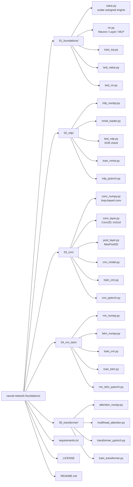

# Neural Network Foundations

A hands-on guide to understanding neural networks by building them from
scratch — starting with raw scalar autograd, working up to NumPy matrix
implementations, and comparing against PyTorch at every stage. Every
module is runnable, verified against hand-computed or numerical checks,
and documented with the *why*, not just the *how*.

> ✅ **All five architectures implemented.** MLP → CNN → RNN/LSTM →
> Transformer, each with from-scratch NumPy math (gradient-checked where
> feasible) and a PyTorch comparison.

## Why this exists

Frameworks like PyTorch hide the mechanics of training behind
`loss.backward()` and `optimizer.step()`. This repo rebuilds those
mechanics by hand first, so nothing is magic later — every layer, every
gradient, every training loop is code you can read top to bottom. Where
the from-scratch version diverges from PyTorch — in behavior, stability,
or output quality — that divergence is documented rather than hidden,
because those moments taught more than the parts that worked on the first
try.

## Roadmap

- [x] **01 — Foundations**: scalar autograd engine (`Value`), a
      `Neuron`/`Layer`/`MLP` built on top of it, trained with plain
      gradient descent. Includes a real bug-and-fix (dead ReLU on an
      output layer).
- [x] **02 — MLP**: matrix-based MLP in NumPy, verified on XOR, trained
      on real MNIST (96.7% test accuracy), plus a PyTorch comparison
      (96.5%).
- [x] **03 — CNN**: convolution and max-pooling built from scratch
      (im2col trick), backward pass verified with numerical gradient
      checking, trained on MNIST (86.9%), plus a PyTorch comparison
      (85.8%).
- [x] **04 — RNN/LSTM**: char-level language model. Plain RNN trained
      with BPTT destabilizes late in training (loss spikes to 42.0);
      LSTM's gated cell state fixes this (converges to 0.014, no spike),
      matching the historical reason LSTMs replaced vanilla RNNs. Plus a
      PyTorch `nn.LSTM` comparison.
- [x] **05 — Transformer**: scaled dot-product and multi-head attention
      verified by hand (forward pass only), full encoder block trained
      in PyTorch. Reveals a real gap between training loss and
      generation quality (exposure bias) on tiny datasets.

## Key lessons learned

- **Backprop is just the repeated chain rule.** A `Value` object
  remembers how it was computed so gradients can flow backward through
  the graph — this one idea underlies every architecture in this repo.
- **Dead ReLU is real.** Applying ReLU on an output layer can
  permanently zero out gradients if targets need negative values — only
  hidden layers should be nonlinear.
- **Numerical gradient checking catches real bugs.** Perturbing a
  weight by a tiny amount and comparing the resulting loss change
  against the analytically computed gradient is how the CNN's backward
  pass was validated to match exactly (see `03_cnn/`).
- **RNN gradients are unstable with plain SGD-style training.** The
  same weight matrix (`W_hh`) gets applied at every time step, so
  gradients can compound and explode across long sequences.
- **LSTM's additive cell-state update is what fixes it.** Gradient
  flowing through the cell state is scaled by a learned, bounded forget
  gate instead of a repeated raw matrix multiply — visible directly in
  the loss curves, not just in theory (see `04_rnn_lstm/`).
- **Low training loss doesn't guarantee good generation.** Teacher
  forcing during training and autoregressive sampling during generation
  are different regimes; a model can nearly memorize its training data
  (near-zero loss) while still degrading into repetitive loops when
  generating — a real, well-documented transformer phenomenon (see
  `05_transformer/`).

## Structure



Each module folder has its own `README.md` with the math, the results,
and any interesting failure modes encountered along the way — start
there for details beyond this overview.

## Setup

```bash
python3 -m venv venv
source venv/bin/activate      # Windows: venv\Scripts\activate
pip install numpy torch matplotlib
```

## Running a module

Each module is self-contained — `cd` into it and run its scripts
directly:

```bash
cd 01_foundations
python3 test_value.py
python3 test_nn.py
python3 train_toy.py
```

```bash
cd 02_mlp
python3 test_mlp.py        # XOR sanity check
python3 train_mnist.py     # NumPy MLP on real MNIST
python3 mlp_pytorch.py     # PyTorch comparison
```

```bash
cd 03_cnn
python3 test_conv.py
python3 test_conv_layer.py
python3 test_pool.py
python3 train_cnn.py
python3 cnn_pytorch.py
```

```bash
cd 04_rnn_lstm
python3 test_rnn.py && python3 train_rnn.py
python3 test_lstm.py && python3 train_lstm.py
python3 rnn_lstm_pytorch.py
```

```bash
cd 05_transformer
python3 test_attention.py
python3 test_multihead.py
python3 train_transformer.py
```

## From-scratch → framework mapping

A quick reference for what each hand-written piece corresponds to in
PyTorch:

| From scratch | PyTorch |
|---|---|
| `Value` (scalar autograd) | `torch.Tensor` with `requires_grad=True` |
| `W @ x + b` | `nn.Linear` |
| manual softmax + cross-entropy backward | `nn.CrossEntropyLoss` |
| `p.grad = 0.0` / `W -= lr * dW` | `optimizer.zero_grad()` / `optimizer.step()` |
| `Conv2D` (im2col) | `nn.Conv2d` |
| `MaxPool2D` | `nn.MaxPool2d` |
| BPTT in `rnn_numpy.py` | `nn.RNN` |
| gated cell update in `lstm_numpy.py` | `nn.LSTM` |
| `scaled_dot_product_attention` | `nn.MultiheadAttention` |

## License

MIT — see `LICENSE`.